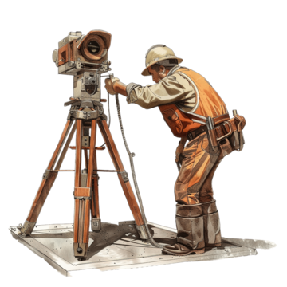
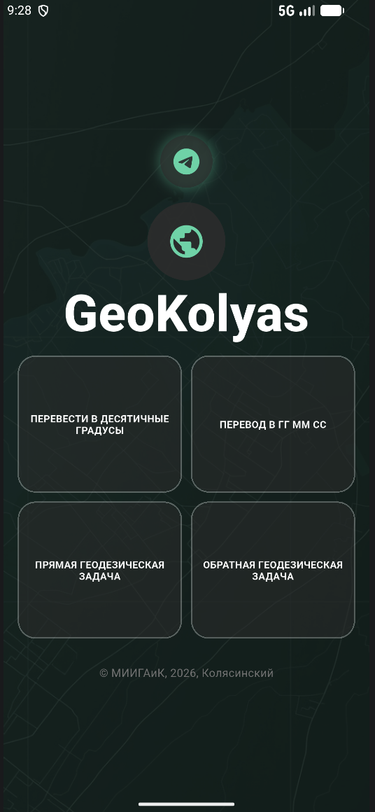
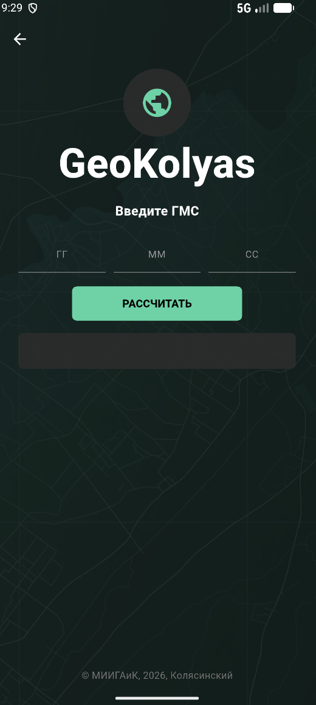
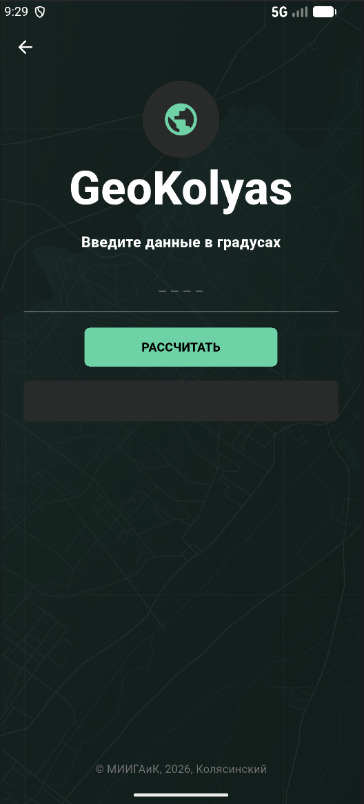
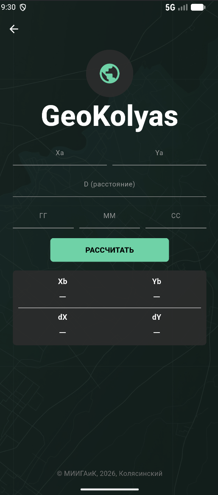
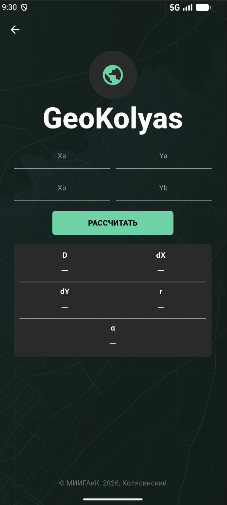

<div align="center">



# GeoKolyas

### Геодезический калькулятор на Flutter


</div>

---

## О проекте

**GeoKolyas** — мобильное приложение **«Геодезический калькулятор»**, разработанное на Flutter в рамках практической работы по предмету **«Основы разработки мобильных приложений»**.

Приложение реализует четыре вычислительные функции:

1. перевод градусов из формата **ГГ° ММ′ СС″** в десятичные градусы;
2. перевод **десятичных градусов** в формат **ГГ° ММ′ СС″**;
3. решение **прямой геодезической задачи**;
4. решение **обратной геодезической задачи**.

Приложение также содержит адаптивный интерфейс, обработку пользовательского ввода, переход между полями с клавиатуры, копирование результата в буфер обмена и кастомное оформление.

---

## Скриншоты

<div align="center">

### Главный экран



</div>

<div align="center">

### Расчётные экраны

<table>
  <tr>
    <td align="center">
      <br>
      <b>ГМС → десятичные градусы</b>
    </td>
    <td align="center">
      <br>
      <b>Десятичные градусы → ГМС</b>
    </td>
  </tr>
  <tr>
    <td align="center">
      <br>
      <b>Прямая геодезическая задача</b>
    </td>
    <td align="center">
      <br>
      <b>Обратная геодезическая задача</b>
    </td>
  </tr>
</table>

</div>

---

## Возможности

- 4 отдельных экрана для геодезических вычислений.
- Главный экран с навигацией по функциям.
- Проверка ввода: приложение не выполняет расчёт, если поля пустые или введены некорректные значения.
- Поддержка десятичных чисел через точку и запятую.
- Кнопка **«Рассчитать»** на каждом экране.
- Переход между полями через кнопку **Next** на клавиатуре.
- Расчёт по кнопке **Done / OK** на последнем поле.
- Скрытие клавиатуры при завершении ввода.
- Копирование результата в буфер обмена.
- Адаптивная вёрстка под разные размеры экранов.
- Кастомный фон, иконка приложения и тёмная цветовая тема.

---

## Архитектура проекта

```text
lib/
├── main.dart                     # точка входа в приложение
├── screens/
│   ├── home_page.dart            # главный экран и навигация
│   ├── gms_page.dart             # ГМС → десятичные градусы
│   ├── deg_page.dart             # десятичные градусы → ГМС
│   ├── direct_page.dart          # прямая геодезическая задача
│   └── round_page.dart           # обратная геодезическая задача
└── utils/
    ├── geo_math.dart             # математическая логика
    ├── responsive.dart           # адаптивные размеры интерфейса
    └── clipboard_helper.dart     # копирование результата в буфер
```

### Принцип разделения логики

Проект разделён на две основные части:

- **UI-слой** — экраны в папке `screens/`;
- **вычислительная логика** — класс `GeoMath` в файле `utils/geo_math.dart`.

Такой подход упрощает поддержку проекта: интерфейс можно менять отдельно от формул и вычислений.

---

## Реализованные вычисления

### 1. ГМС → десятичные градусы

Формула:

```text
D = ГГ + ММ / 60 + СС / 3600
```

---

### 2. Десятичные градусы → ГМС

Выполняется обратное преобразование:

```text
ГГ = целая часть градуса
ММ = целая часть минут
СС = остаток, переведённый в секунды
```

---

### 3. Прямая геодезическая задача

По исходным координатам точки `A`, расстоянию `D` и дирекционному углу `α` вычисляются приращения и координаты точки `B`:

```text
ΔX = D · cos(α)
ΔY = D · sin(α)

Xb = Xa + ΔX
Yb = Ya + ΔY
```

---

### 4. Обратная геодезическая задача

По координатам двух точек `A` и `B` вычисляются:

```text
ΔX = Xb - Xa
ΔY = Yb - Ya
D  = √(ΔX² + ΔY²)
```

Также определяется румб, дирекционный угол и четверть направления.

---

## Используемые технологии

- **Flutter**
- **Dart**
- **Material 3**
- **url_launcher**
- **flutter_launcher_icons**
- Android SDK / Android Emulator

---

## Как запустить проект

### 1. Клонировать репозиторий

```bash
git clone https://github.com/kolyaspr/geokolyas_geodesy_calc.git
cd geokolyas_geodesy_calc
```

Если репозиторий будет создан под другим аккаунтом, замените ссылку на свою.

---

### 2. Установить зависимости

```bash
flutter pub get
```

---

### 3. Проверить доступные устройства

```bash
flutter devices
```

---

### 4. Запустить на Android-эмуляторе

```bash
flutter run -d emulator-5554
```

Если идентификатор эмулятора другой, возьмите его из вывода команды `flutter devices`.

---

## Как собрать APK

Для сборки release APK выполните:

```bash
flutter build apk --release
```

Готовый APK будет находиться по пути:

```text
build/app/outputs/flutter-apk/app-release.apk
```

Этот файл можно передать на Android-устройство и установить вручную.

---

## Как установить APK на Android

### Способ 1. Через файл APK

1. Соберите APK командой:

   ```bash
   flutter build apk --release
   ```

2. Найдите файл:

   ```text
   build/app/outputs/flutter-apk/app-release.apk
   ```

3. Передайте файл на Android-устройство.
4. Откройте APK на телефоне.
5. Разрешите установку из неизвестных источников, если Android попросит.
6. Установите приложение.

---

### Способ 2. Через ADB

Если устройство подключено по USB или запущен эмулятор:

```bash
adb install build/app/outputs/flutter-apk/app-release.apk
```

При повторной установке:

```bash
adb install -r build/app/outputs/flutter-apk/app-release.apk
```

---

## Автор

**Колясинский Степан Александрович**  
Практическая работа №1  
Предмет: **Основы разработки мобильных приложений**  
МИИГАиК, 2026

---

<div align="center">

**GeoKolyas**  
Геодезические расчёты в мобильном приложении на Flutter

</div>
